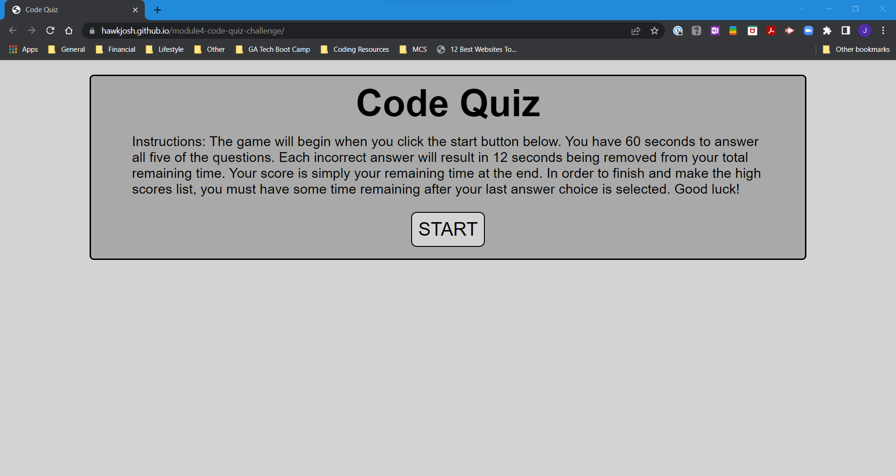

# Code-Quiz

## Description

In this challenge, I created a timed multiple-choice quiz on JavaScript fundamentals that stores high scores. My coding quiz app runs in the browser and features dynamically updated HTML and CSS content powered by JavaScript.

## Screenshot

## Link

To view the deployed website, [CLICK HERE](https://hawkjosh.github.io/Code-Quiz/).
